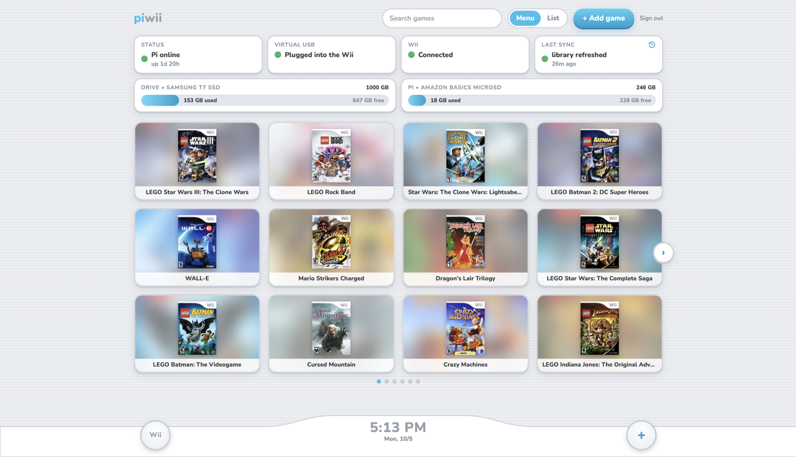
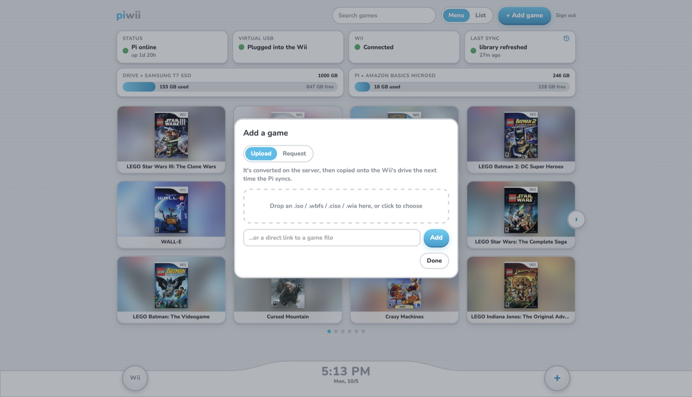
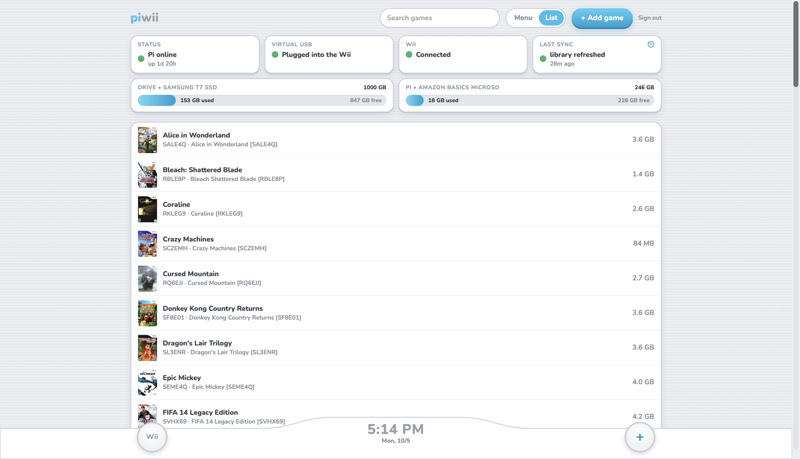
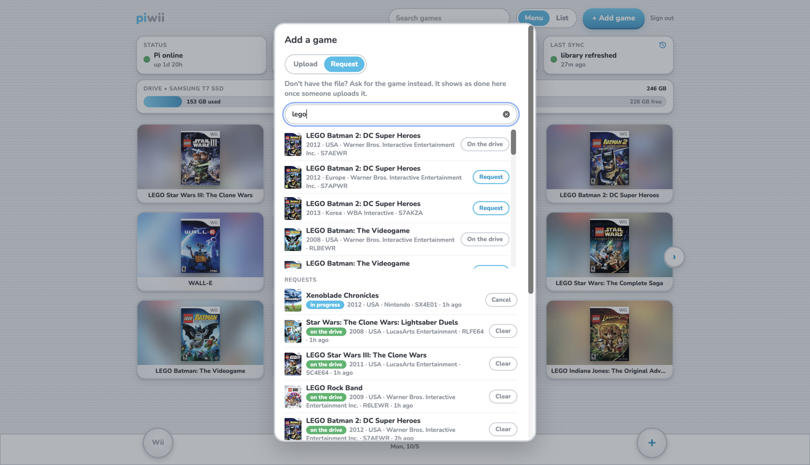

# piwii

Turn a Raspberry Pi into a network-fed USB drive for a softmodded Wii running USB Loader GX.



## Terms

- **The Pi:** the Raspberry Pi plugged into the Wii. It exports the staging share and syncs games onto the drive (`system/`).
- **The server host:** the machine on the home network that runs the web server and mounts the Pi's share. Any always-on Linux machine with Docker works; this setup uses an Unraid server, and the scripts in `server/host/` are written for Unraid.
- **The web server:** piwii's web app and API (`server/`), running as the `piwii` Docker container on the server host. It converts games and copies them to the Pi.
- **The game drive:** the USB drive the Pi passes through to the Wii, holding the games (this setup: a 1 TB Samsung T7). An SSD works best: it draws little power from the Pi's USB port, never spins down (USB loaders can stall waiting for a sleeping hard drive), and makes the Pi's sync copies fast. The Wii's side of the link is USB 2.0, so games don't load much faster than from a hard drive.

## Overview

- **Whole-drive passthrough.** The Pi hands the entire game drive's block device to the Wii as a USB mass storage device (USB gadget mode via `dwc2` + `libcomposite`, configfs `mass_storage` function). The gadget's backing file is the drive's stable path under `/dev/disk/by-id/` (`PIWII_DISK` in [`/etc/default/piwii`](system/etc/default/piwii.example)), not `/dev/sda`, because the `sdX` name can change between boots.
  - No disk image. FAT32 caps files at 4 GB, so an image could not live on the already-FAT32 drive. Passthrough gives the Wii the whole drive (1 TB here), and games already on the drive work as-is.
  - The drive stays MBR + one FAT32 partition (here `WII_1TB`, 32 KB clusters), the layout USB Loader GX expects. Games go in `/wbfs/`.
- **Exclusive access.** Exactly one side owns the drive at a time: either it is attached to the Wii as a gadget, or it is mounted on the Pi. Never both, or FAT32 gets corrupted. The Pi must never auto-mount the game drive. The desktop's automount (udisks) mounted it at `/media/admin/WII_1TB` on first plug-in, and setup has to turn that off.
- **Adding games: through the web server only.** People use the piwii web server (`server/`, port 8790) on the server host: a Wii Menu style page at `/`, with the original page at `/legacy`. Uploads are chunked and resumable: 50 MB chunks, under Cloudflare's 100 MB request limit, each written straight into place, so there's no join step ([`upload.js`](server/static/upload.js), `/api/uploads`). Covers and game details come from GameTDB and are cached in `server/work/`. Hostnames come from `PIWII_DOMAIN` in `server/.env`, which can list several domains (examples here use `example.com`). Public access goes through the server host's Cloudflare tunnel at `https://wii.example.com`, with a username/password login from `server/.env`. At home, the page sends uploads straight to `https://wii.lan.example.com` instead, served by the server host's Caddy (a wildcard `*.lan.example.com` DNS-only record pointing at the server host's LAN address). The login cookie is shared across the domain, so one sign-in covers both. It converts each game with `wit` into a split WBFS folder named `Title [ID6]` and writes it into the Pi's NFS staging area. People never mount the Pi's share; only the server host does, for the web server (see [NFS staging share](#nfs-staging-share)).

   

- **Game requests.** The Add popup's Request tab searches GameTDB's retail Wii discs (no mods, demos or GameCube) and records a request: ID6, title, year, region, publisher, GameTDB link and an optional note. Requests live in `server/work/requests.json`. A request shows as done once its ID is in `library.json`, so whoever fulfils it just gets the game onto the drive the normal way. Other tools can read the list from `GET /api/requests` (a program uses its own API token from `PIWII_API_TOKENS`, which only opens the request-fulfilling routes; `?status=requested` for just the open ones, and an ETag so polling every few seconds costs an empty `304` when nothing changed); `POST /api/requests {id, note}` adds one, `PATCH /api/requests/{id} {status, note}` updates it (status `requested`, `in progress`, `throttled`, `error` or `done`), and `DELETE /api/requests/{id}` removes it. Being on the drive overrides the stored status. Full reference: [`server/docs/requests-api.md`](server/docs/requests-api.md). Ways to get a file into the pipeline (upload API, link, and the `work/import/` folder for rsync or other containers, processed with `POST /api/import`): [`server/docs/adding-games.md`](server/docs/adding-games.md).

  

  - **Split size:** the web server runs `wit copy --wbfs --split` with no explicit size. For WBFS output, wit's default is `DEF_SPLIT_SIZE_ISO` = `0xffff8000` = 4,294,934,528 bytes (4 GiB − 32 KiB), the standard USB loader split, under FAT32's 4 GiB − 1 byte file limit. Games over that become `ID6.wbfs` + `ID6.wbf1`. This was checked in the [wit source](https://github.com/Wiimm/wiimms-iso-tools) (`lib-std.h`; `lib-file.c` uses it for `OFT_WBFS` when `opt_split_size` is 0). The "4 GB" in `wit help copy` is the 4,000,000,000-byte default for other formats, such as WDF and WIA.
- **Sync.** When a folder lands in `staging/ready/`, [`piwii-sync`](system/usr/local/sbin/piwii-sync) waits 5 s to batch back-to-back arrivals. If the Wii is connected, it then holds until the Wii has been quiet on the game drive for 45 s (`PIWII_SYNC_IDLE`), judged by the T7's block sector counters. What counts as busy is set by `PIWII_SYNC_GUARD`:
  - `throughput` (default): a 5 s check counts as busy only when more than 128 KiB moved (`PIWII_SYNC_BUSY_KIB`). USB Loader GX polls about 4 KiB every 10 s even when idle in its menu, and this mode ignores that.
  - `any`: any I/O counts as busy. It's stricter, but it never goes quiet while the loader's menu is open, so syncs wait until the Wii leaves the loader or turns off.

   After that it:
  1. detaches the gadget (a software unplug; the cable stays connected)
  2. mounts the game drive on the Pi
  3. copies each new game folder into `/wbfs/`, moving duplicates to `duplicates/` (deleted after 7 days, `PIWII_SYNC_DUP_DAYS`; cleaned at boot and on each sync) and anything it can't place to `failed/` (never deleted)
  4. removes macOS metadata
  5. writes `staging/library.json`
  6. unmounts and reattaches the gadget, even if a step fails

  Conversion happens on the server host beforehand, so the Wii only loses the drive for the copy: about 45 s per 2 GB, limited by the SD card's 46 MB/s read speed. The idle hold lowers the risk of pulling the drive mid-game but can't rule it out: a game with everything in RAM can go minutes without reading. Avoid adding games mid-game, and restart USB Loader GX afterwards so it rescans.

### Why the web server runs on a separate host

The Pi could run the web server itself, but splitting the work avoids the Pi's bottlenecks:

- **Conversion is heavy.** `wit` reads a multi-GB game and writes a converted copy of about the same size. On the Pi it would be slow and would compete with the Pi's main job, serving the drive to the Wii.
- **The Pi has nowhere good to put files.** The game drive is attached to the Wii nearly all the time, so the Pi can't write to it. Uploads and conversions would have to land on the SD card, writing 2–3× each game's size to storage that's slow and wears out under heavy writes.
- **The slow Wi-Fi transfer happens in the background.** Each game crosses the Pi's Wi-Fi once either way. Here, the upload finishes as soon as the wired server host has the file, and the copy to the Pi runs afterwards; on the Pi, the uploader would wait out the Wi-Fi transfer.
- **The server host already has the plumbing.** Docker, a tunnel and reverse proxy for public and home-network routes, monitoring and backups are easier to run on an always-on server than on the Pi.
- **The Pi stays simple.** It only runs the gadget, sync and status scripts, so a web server crash or hang can never affect the drive the Wii is using.

How a 4 GB game moves in each design (rough times from this setup):

| Step | Web server on the server host (this design) | Everything on the Pi |
|---|---|---|
| Upload | device → server host, wired or tunnel: fast | device → Pi over Wi-Fi: ~7–10 min, and the uploader waits |
| Convert | on the server host's disk and CPU: under a minute | on the Pi's SD card (reads ~46 MB/s, slower writes): ~3–5 min more |
| Hand-off | server host → Pi over Wi-Fi (NFS): ~7–10 min, in the background | none |
| Sync to the drive | SD card → game drive: ~45 s per 2 GB | the same |

So moving everything to the Pi drops the fast wired hop, not the slow Wi-Fi one, and adds SD card time: probably a few minutes slower per game. Putting the Pi's staging on a USB SSD instead of the SD card would close most of that gap.

The cost of this design is the NFS link between the two machines: if it stalls, copies to the Pi wait. The web server is built to ride that out (it never restarts over NFS, retries copies, and serves cached data), and the Pi hands out no NFS delegations, so the server host's cache can't silently go stale (see [NFS staging share](#nfs-staging-share)). Running everything on the Pi would remove NFS entirely, at the price of slower conversions, SD card wear and Wi-Fi uploads; a Pi 5 with fast storage makes that more reasonable.

## Hosting on the server host

The web server runs as the `piwii` container on the server host. Everything piwii needs is in this repo:

- [`server/compose.yaml`](server/compose.yaml) and `server/.env` (copied from [`server/.env.example`](server/.env.example))
- the Pi's share kept mounted on the host (see [NFS staging share](#nfs-staging-share))
- optional: routes for `wii.<domain>` from the internet (e.g. a Cloudflare tunnel) and `wii.lan.<domain>` on the home network (e.g. a reverse proxy), with `PIWII_DOMAIN` set
- optional: monitoring on `/healthz` (is the web server up) and `/healthz/pi` (is the Pi reachable through the share)
- optional: a favicon. None is included; add your own `server/static/favicon.png` (180×180, for home screens) and `server/static/favicon-32.png` (32×32, for tabs) before building the container. Both are gitignored. Without them the page just has no icon.

To deploy, clone this repo on the server host, start the container from the clone, and after changes run `git pull` there and rebuild the container. On Unraid, the mount script in `server/host/` also runs from the clone, so `git pull` updates it too.

> **Alpha:** while piwii is in alpha, `main` is rewritten as a single commit on each release, so `git pull` on the server host fails with diverging histories. Use `git fetch && git reset --hard origin/main` instead. It drops local edits to the repo's own files but keeps ignored ones such as `server/.env` and `server/work/`.

This setup's own deployment (the Unraid host's compose project, its tunnel and reverse proxy routes, and its Uptime Kuma monitors) is kept in a separate, private deployment repo, `seedbox-config` (folder `piwii/`), next to the config for the host's other services. It's specific to this setup; you don't need it to run piwii.

## Setting it up for your own hardware

Everything specific to one setup lives in a few files. Most have a template next to them (`*.example`); the live versions in this repo are this setup's.

**On the Pi**

Clone this repo on the Pi and run the install script from it. It installs the scripts, services and kernel modules list from `system/`, adds the per-Pi files below from their templates when they're missing (it never overwrites them), installs `nfs-kernel-server` and `python3` if needed, enables the services, and reloads or restarts only what changed:

```bash
git clone https://github.com/anuvgupta/piwii.git ~/piwii
cd ~/piwii && sudo ./install-pi.sh
```

Fill in the per-Pi files it lists, then run it again (or reboot). To update the Pi later, `git pull` and run it again. `sudo ./install-pi.sh --check` only reports what's out of date and changes nothing. The script never restarts `piwii-gadget` on its own, because that unplugs the game drive from the Wii: it says when that's needed, or pass `--restart-gadget`. It doesn't replace `config.txt` either; it only adds the USB gadget line (`dtoverlay=dwc2,dr_mode=peripheral`) if it's missing, keeping a backup.

> **Alpha:** while piwii is in alpha, `main` is rewritten as a single commit on each release, so `git pull` on the Pi fails with diverging histories. Use `git fetch && git reset --hard origin/main` instead, then run the script. The reset only changes the clone; the files installed on the Pi change when the script runs.

| File | From | What to set |
|---|---|---|
| `/etc/default/piwii` | [`piwii.example`](system/etc/default/piwii.example) | `PIWII_DISK` (the game drive under `/dev/disk/by-id/`), optional `PIWII_GADGET_SERIAL`, `PIWII_DRIVE_LABEL` and `PIWII_SD_LABEL` (names on the page's storage cards), and optional tuning (`PIWII_STATUS_INTERVAL`, `PIWII_SYNC_*`, listed in the template). Restart `piwii-status` after changing labels. |
| `/etc/udev/rules.d/99-piwii-drive.rules` | [`99-piwii-drive.rules.example`](system/etc/udev/rules.d/99-piwii-drive.rules.example) | The game drive's serial (`ID_SERIAL_SHORT`), so the Pi never automounts it. The template says how to find it. Then `sudo udevadm control --reload && sudo udevadm trigger`. |
| `/etc/exports.d/piwii.exports` | [`piwii.exports.example`](system/etc/exports.d/piwii.exports.example) | The server host's LAN IP (`<server-host-ip>`), the only machine allowed to mount the share. Then `sudo exportfs -ra`. |
| `/etc/sudoers.d/010-admin-nopasswd` | [the file in `system/`](system/etc/sudoers.d/010-admin-nopasswd) | Passwordless sudo for the Pi's admin account (`admin` here; change the name if yours differs), mode `440`. Setup and sync scripts run as root over non-interactive SSH, which can't type a password. Test with `sudo -k; sudo -n true` (a plain `sudo -n` can pass on a cached password). Anyone who can log in as that account effectively has root. |
| `/srv/piwii/staging/.piwii-staging` | (empty file) | Created by the install script if missing; the web server only uses the share when it's there (see [NFS staging share](#nfs-staging-share)). |

Files in `system/` mirror their paths on the Pi. The install script copies the rest of them (modules, services, scripts) as-is. The sudoers file is the one it only checks: add it by hand if you want it.

**On the server host**

| File or place | From | What to set |
|---|---|---|
| `server/.env` | [`.env.example`](server/.env.example) | `PIWII_USERNAME` and `PIWII_PASSWORD` (the login), `PIWII_DOMAIN` (your domain, or several comma-separated, for `wii.<domain>` and `wii.lan.<domain>`; leave empty to use piwii only at its own address), and on Unraid `PIWII_UD_DEVICE` (the Pi's export, `<pi-ip>:/srv/piwii/staging`). Optional: `PIWII_API_TOKENS` (named API tokens for programs that fulfil requests; see [requests-api.md](server/docs/requests-api.md#api-token-service-accounts)), and `PIWII_CORS_ORIGINS` and `PIWII_COOKIE_DOMAIN` override what `PIWII_DOMAIN` derives. (Only when running `server/app.py` outside Docker: `PIWII_WIT` points at the `wit` binary; the image already has it on the `PATH`.) |
| [`server/compose.yaml`](server/compose.yaml) | | The bind `/mnt/addons/piwii:/mnt/piwii:rslave`: on another host, change the left side to the parent folder of wherever the share is mounted. |
| The share mount | | On Unraid: an Unassigned Devices remote share matching `PIWII_UD_DEVICE`, and the cron line from [`server/host/`](server/host/) installed as `/boot/config/plugins/dynamix/piwii-staging-mount.cron`. Elsewhere: your own automount (see [NFS staging share](#nfs-staging-share)). |
| `server/static/favicon.png`, `favicon-32.png` | | Optional icons (180×180 and 32×32). |

**Around them**

- **The router:** reserve the Pi's and the server host's IPs, since the export and the mount use them.
- **DNS and routes (optional):** `wii.<domain>` to the web server through a tunnel or reverse proxy, and `wii.lan.<domain>` to it on the home network.
- **Monitoring (optional):** point an uptime checker at `/healthz` and `/healthz/pi`. On Unraid, the mount script also reports to an Uptime Kuma push monitor if `/boot/config/scripts/kuma-push.sh` exists (a small helper that defines `kuma_push`; this setup's comes from its deployment repo). Without it, the script skips reporting.

## NFS staging share

The Pi exports `/srv/piwii/staging` on its SD card through `nfs-kernel-server`, configured in [`system/etc/exports.d/piwii.exports`](system/etc/exports.d/piwii.exports) (this setup's live file; [`piwii.exports.example`](system/etc/exports.d/piwii.exports.example) is the same with `<server-host-ip>` in place of the server host's address):

- **Only the server host can mount it** (`192.168.4.32`, over the home LAN). Every other host is refused.
- **`all_squash` to `admin` (1000:1000)**, so everything the server host writes is owned by `admin`. The Pi doesn't trust the server host's root (no `no_root_squash`).
- **Default `secure`**: client ports must be privileged (<1024). The server host's kernel NFS client uses those. `insecure` is deliberately off.
- **Layout:** `.incoming/` holds folders the web server is still writing, `ready/` holds finished games (renamed in atomically), `duplicates/` and `failed/` hold games sync skipped, and `library.json` lists the game drive's games.
- **Status files for the web page** live in `status/`, a 1 MB RAM-only tmpfs ([`srv-piwii-staging-status.mount`](system/etc/systemd/system/srv-piwii-staging-status.mount)), so frequent status writes never touch the SD card. It's exported to the server host read-only with `fsid=7701`, since tmpfs has no stable ID, and reached through `crossmnt` on the staging export. [`piwii-status`](system/usr/local/sbin/piwii-status) runs as a loop service, every 5 s (`PIWII_STATUS_INTERVAL`), and writes `pi-status.json`: whether the gadget is attached, the Wii link state and its KiB/s, whether the game drive is present, the sync service state, uptime, and staging free space. A loop is used instead of a timer so systemd doesn't log a start/finish pair every 5 s. `piwii-sync` writes `sync-status.json` at each step (settling, waiting-idle with its quiet countdown, detaching, copying, library, reattaching, idle with the last result). Both scripts skip writing if the tmpfs isn't mounted. The web server reads both files in a background thread, so a hung NFS mount shows as "Pi offline" instead of blocking the page. Status older than 60 s also counts as offline.
- **No NFS delegations.** [`system/etc/sysctl.d/piwii.conf`](system/etc/sysctl.d/piwii.conf) sets `fs.leases-enable = 0` on the Pi, so its NFS server never hands the server host a read delegation (permission to trust its cached copy of a file until the Pi recalls it). With delegations on, one recall that didn't land left the server host reading a 70-minute-old `pi-status.json` with no error anywhere; restarting the container doesn't help, since the cache is the server host's kernel's. Without them, the server host re-checks these small files within seconds. The install script applies the setting.
- **NFS outages don't take the web server down.** Pages never read the share directly: a background thread snapshots `library.json` (re-read only when it changes, with a copy kept in `server/work/library-cache.json` for restarts) and the folder names in `ready/`, `failed/` and `duplicates/` every 5 s. A converted game that can't be copied to the Pi stays in `server/work/` and is retried with backoff (30 s, doubling to 30 min, and immediately once the share reads again). A restart loses nothing: on startup, converted games still in `server/work/` are copied, and leftover source files (queued or mid-conversion) are converted again, so nothing is left behind on disk. A big copy over the Pi's Wi-Fi holds up the status reads for minutes, so while a copy is writing data the Pi counts as online. `/healthz` (the Docker healthcheck) never touches NFS, so a slow, unreachable or stale share never gets the container restarted (a restart can't fix any of those). `/healthz/pi` reports whether the Pi's status is fresh, for Uptime Kuma.
- **The server host keeps the share mounted, not Docker**, so the web server starts even while the Pi is down. This is a dependency on the server host: the web server only reaches the Pi if this is running there.
  - **What the web server needs, on any host:** the Pi's share mounted over NFS 4.2 (which `crossmnt` needs to show `status/`) inside a folder whose *parent* is bind-mounted into the container with `rslave`. [`server/compose.yaml`](server/compose.yaml) binds the parent at `/mnt/piwii`, so the share is `/mnt/piwii/staging` inside. A new mount inside that parent reaches the running container, so a remount never needs a web server restart. Binding the share's own mount point would pin the mount the container started with.
  - **Marker file:** while the share is down, `/mnt/piwii/staging` is an empty folder on the server host. The web server reads from or writes to it only when `.piwii-staging` is there, a file at the share root created once on the Pi (`sudo install -o 1000 -g 1000 -m 644 /dev/null /srv/piwii/staging/.piwii-staging`). Without it, the Pi shows offline, the cached library is served, and copies wait and retry.
  - **If the server host runs Unraid (this setup),** [`server/host/`](server/host/) does the mounting:
    - Unraid's Unassigned Devices plugin mounts the share at `/mnt/remotes/piwii-staging` (a remote share entry `<pi-address>:/srv/piwii/staging` in `/boot/config/plugins/unassigned.devices/samba_mount.cfg`, auto-mount on), so it shows in the Unraid UI with any other remote shares. The script finds it by `PIWII_UD_DEVICE` in `server/.env`, which must match that entry exactly; see [`server/.env.example`](server/.env.example).
    - Unassigned Devices only mounts at array start and never retries. [`piwii-staging-mount.sh`](server/host/piwii-staging-mount.sh) runs every minute from cron ([`piwii-staging-mount.cron`](server/host/piwii-staging-mount.cron), installed as `/boot/config/plugins/dynamix/piwii-staging-mount.cron`). It checks the share and asks Unassigned Devices to mount it when it's missing (boot, failed mount) or stale, and otherwise leaves it alone. A hung Pi is left to the `hard` mount, which resumes on its own. It reports to a Kuma push monitor and sends an Unraid notification whenever it mounts. `piwii-staging-mount.sh --remount` drops everything and mounts fresh.
    - The script bind-mounts the share again as a **mirror** at `/mnt/addons/piwii/staging` (`/mnt/addons` is Unraid's folder for mounts the Unassigned Devices plugin doesn't manage), and `/mnt/addons/piwii` is the parent the container gets. Unassigned Devices can't nest mounts, and binding `/mnt/remotes` would hand the container every other remote share. When it re-binds, the script also drops the old mirror inside the container (`nsenter`): once the web server reads `status/`, it's a submount there, and Linux won't propagate an unmount to a mount with submounts.
  - **On another Linux host,** `server/host/` doesn't apply: keep the share mounted yourself (for example a systemd automount or autofs entry, `hard`, NFS 4.2) at a folder like `/mnt/piwii-share/staging`, and change the compose bind to `/mnt/piwii-share:/mnt/piwii:rslave`.
  - Recreating `status/` (as a Pi reboot does) doesn't leave stale handles: its fixed `fsid=7701` keeps the handle valid. Tested 2026-10-05.
- **Both IPs are reserved in the router** (`192.168.4.61` for the Pi, `192.168.4.32` for the server host), so they don't change. The export and the mount use them (on Unraid, that's the Unassigned Devices entry and `PIWII_UD_DEVICE`); if either is ever re-reserved, update both.

## What checks what, and how often

Every timer, loop and poll in the system, by where it runs.

**On the Pi**

| What | How often | Does |
|---|---|---|
| `piwii-status` (loop service) | every 5 s (`PIWII_STATUS_INTERVAL`) | Writes `status/pi-status.json`: gadget, Wii link, game drive, sync state, free space, hardware labels |
| `piwii-sync.path` | on change, not polled | Starts `piwii-sync` when `ready/` gets a folder; it writes `status/sync-status.json` at each step |
| `piwii-sync` idle guard | every 5 s while waiting | Holds a sync until the Wii has been quiet on the game drive for 45 s |
| `piwii-sync` duplicates cleanup | at boot and every sync | Deletes `duplicates/` entries older than 7 days |

**On the server host**

| What | How often | Does |
|---|---|---|
| [`piwii-staging-mount.sh`](server/host/piwii-staging-mount.sh) (cron) | every minute | Remounts the Pi's share if it's missing or stale and refreshes the mirror; pushes to Kuma |
| Container health report (this setup's deployment repo, cron) | every 2 min | Reports the piwii container's Docker health to Kuma |

**In the web server (background threads)**

| What | How often | Does |
|---|---|---|
| Docker healthcheck → `/healthz` | every 60 s | Is the web server up (never touches NFS); autoheal restarts it after 3 failures |
| Pi status reader | every 5 s | Reads `pi-status.json` and `sync-status.json` into memory ("Pi online" = under 60 s old, or a copy sent data in the last 60 s) |
| Staging snapshot | every 5 s | Reads `library.json` (only when changed; cached to `work/library-cache.json`) and the folder names in `ready/`, `failed/`, `duplicates/` |
| Copy-to-Pi retry | 30 s, doubling to 30 min | After a failed copy; retries at once when the snapshot reads the share again |
| Cover prefetch | every 10 min | Caches GameTDB covers for every game on the drive |
| GameTDB titles / game info | daily (hourly after a failure) | Re-downloads each once it's a week old |
| Upload janitor | hourly | Deletes chunked uploads idle for a day |

Request statuses aren't polled in the web server: each `GET /api/requests` works them out from the requests in memory (saved to `requests.json` on each change, read only at startup) and the staging snapshot, so they're at most 5 s behind.

**In the browser (the Wii Menu page)**

| What | How often | Calls |
|---|---|---|
| Main refresh | every 3 s | `/api/pi`, `/api/jobs`, `/api/library`: Pi status, game progress, the grid |
| Import list | every 3 s while the Add popup's Upload pane is open | `/api/import`: files in `work/import/` waiting for **Import** |
| Requests | every 3 s while the Add popup's Request tab is open | `/api/requests`: request statuses (only redrawn when something changed) |

**Outside piwii**

- **Uptime Kuma** (this setup's monitoring, on another machine) probes `/healthz` and `/healthz/pi` every 60 s, and expects the push monitors' reports every few minutes. Its monitors are defined in the deployment repo.
- **Apps that fulfil requests** poll `GET /api/requests` themselves ([`server/docs/requests-api.md`](server/docs/requests-api.md)).

## Requirements

- A Raspberry Pi with USB device-mode support: Pi Zero 2 W, Pi 4 or Pi 5. On a Pi 4 or 5, the USB-C port is the one that connects to the Wii, so power comes from a power/data splitter cable or the GPIO pins.
- A separate power supply for the Pi. The Wii's USB port can't power it reliably.
- Raspberry Pi OS (Debian 13 trixie is what's tested).
- A game drive: any USB drive with one FAT32 partition (MBR), the layout USB Loader GX expects. An SSD works best (see [Terms](#terms)).
- A server host on the same network: any always-on Linux machine with Docker (see [Hosting on the server host](#hosting-on-the-server-host)).
- A softmodded Wii running USB Loader GX.

## Hardware used in this setup

This is what piwii was built and tested on. Similar hardware works; nothing here is required beyond the requirements above.

- **Pi:** Raspberry Pi 4 Model B, 8 GB RAM, with a power/data splitter cable on its USB-C port.
- **Game drive:** 1 TB Samsung T7 external SSD on one of the Pi's USB 3 ports (`uas`, 5 Gbps). The Wii's side of the link is USB 2.0, which is plenty for loading games.
- **Pi boot disk:** an Amazon Basics 256 GB microSD card (233 GB usable). The card's speed limits how fast the Pi copies games onto the drive (about 45 s per 2 GB here), so a faster card or a USB boot drive helps.
- **OS:** Raspberry Pi OS with desktop, Debian 13 trixie, 64-bit.
- **Server host:** an Unraid server on wired Ethernet.

## Status

Works end to end: games are uploaded or imported, converted, copied to the Pi and synced onto the drive, and the Wii plays them. It recovers from NFS outages and web server restarts on its own (tested). Recovery after rebooting the Pi or the server host isn't tested yet.
